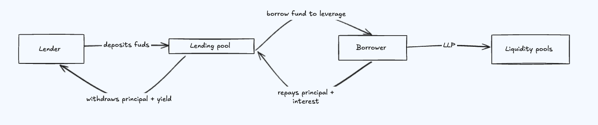

Paystream’s Leveraged Lending Pool is a shared liquidity system designed to support leveraged LP positions. It connects lenders and borrowers through an efficient interest accrual system, dynamic utilization, and risk-managed yield distribution. Below is a breakdown of the core components:



---

## User roles

Paystream’s leveraged lending system is powered by two core user roles: Lenders and LP-users/Borrowers. Lenders supply capital to the protocol in exchange for yield, while LP-users/borrowers utilize that capital to enter leveraged liquidity positions across supported DeFi pools.

---

### 1. Lenders

Lenders deposit a base asset (e.g., SOL, USDC) into the Paystream lending pool. In return, they earn interest over time based on the pool’s utilization and borrowing demand. Their funds help power leveraged trading opportunities for other users. The protocol ensures lender capital remains liquid, allowing for instant withdrawals at any time. Interest is distributed proportionally based on each lender’s share in the pool, and accrual occurs per block.

### 2. Leveraged lp users / Borrowers

LP users access capital from the lending pool to enter leveraged LP (Liquidity Provider) positions in supported pools like DLMM or DAMM V2. They can choose to invest manually or use auto-trading by copying another wallet's strategy. Borrowers are required to maintain a healthy Loan-to-Value (LTV) ratio to avoid liquidation. Before entering a position, their deposited SOL is automatically converted into the appropriate tokens for the chosen pool.

---
## Yield Mechanics

Paystream tracks and distributes interest using two index systems: GLI for lenders and BLI for borrowers. Lenders earn yield based on pool utilization. Borrowers pay interest based on their leverage tier and usage time. When repaying, the system calculates interest using the difference between the current and initial index values. This setup keeps yield distribution accurate and efficient without constant updates.

---
### 1. Interest rate 

- **Borrow rate depends on**
    - *Types of pools and leverage levels (maximum of the category)*
        - **12 %** for 1 **– 1.5 ×** leverage
        - **15 %** for **1.5– 2×** leverage
        - **17 %** for **2 – 3×** leverage
    - utilization rate
    
    the borrow rate is variable at every utilization point 
    
### 2. Global Liquidity Index (GLI)

The **GLI** tracks cumulative yield earned by the lending pool over time. Each time a borrower accrues interest, the LLI updates to reflect that yield.

- Maintained for both **lenders** and **borrowers**
- Increases with each borrower-interest event
- Used to calculate lender yield on exit


Whenever a lender deposits or a borrower takes a loan, we record the current index value as a **snapshot**:

- For **lenders**: store `LLI_entry` at the time of deposit
- For **borrowers**: store `BLI_entry` based on their **leverage tier**

When they later withdraw or repay, we compare the current index to the snapshot to determine how much interest they have earned or owe.

> Note  Because there are three borrowing-rate tiers (by leverage), we maintain three global indices on the borrowing side.

#### a. Lending liquidity Index 

LLI represents how much the lending pool has grown over time due to interest paid by borrowers.
When a lender deposits funds, a snapshot (LLI_entry) is taken. When the lender exits, the current index (LLI_now) determines how much yield they've earned.

##### LLI update formula

```
LLI(t) = LLI(t-1) × (1 + LendingRate × Δt)
```


---

#### b. Borrower liquidity index 

The Borrower Liquidity Index (BLI) is a running “interest meter” that tells us how much a borrower’s debt has grown since they opened the position.

- When a loan is taken, we snapshot the index as BLI_entry.
- As blocks pass, the index rises with the applicable borrow rate.
- At repayment, the ratio BLI_now / BLI_entry shows the exact interest multiplier to apply on the original principal.
- There are three separate Borrower Liquidity Indexes because each leverage tier (1×, 2×, 3×) has a different interest rate. To track interest accurately for each borrower type, a dedicated index is maintained per tier, ensuring precise repayment calculations.

##### Borrowers Liquidity Index update formula
```
BLI(t) = BLI(t-1) × (1 + borrowRate × Δt)
```

##### Three BLI's 

Each leverage / risk bucket compounds independently.

| Tier | Typical LTV / leverage | Symbol |
| --- | --- | --- |
| 1 | ≤ 1 × (safe) | `BLI₁` |
| 2 | ≤ 2 × (medium) | `BLI₂` |
| 3 | ≤ 3 × (high) | `BLI₃` |

##### Per‑Tier Update Rule

$$
\text{bli}_{k,t} = \text{bli}_{k,t-1} \times \left(1 + \text{borrowRate}_k \times \Delta t \right)
$$


> Note  1 + rate × Δt is the compound-interest factor.
> 
> For **simple interest**, replace it with `borrowRate × Δt`.
> 
> Note - for each category a different index is calculated


---

### 3. Total Borrow-Rate Formula

```
totalBorrowRate = (B1 × U1 + B2 × U2 + B3 × U3) / totalUtilization
```

**Where**

- `B1`, `B2`, `B3` = Borrow rates for leverage levels different category
- `U1`, `U2`, `U3` = Utilization (borrowed amount / total available) for each borrower type
- `totalUtilization = U1 + U2 + U3`


### 4. total lending rate formula 

```
LendingRate = totalborrowRate x totalUtilization x  (1 - riskFactor)
```

---

### 5. repayment and yield 

**interest paid by the borrower**

```
interest = principal * (BLI_now_k / BLI_entry_k - 1)
```

**Yield earned by lender **

```
Yield  = deposit × (LLI_now / LLI_entry)
```


Note - snapshot is taken every time the borrower takes a leverage / loan for the respective borrowed amount 
-Both *LLI* (for lenders) and *BLI₁ / BLI₂ / BLI₃* (for borrowers) are updated at regular intervals, ideally per block. 