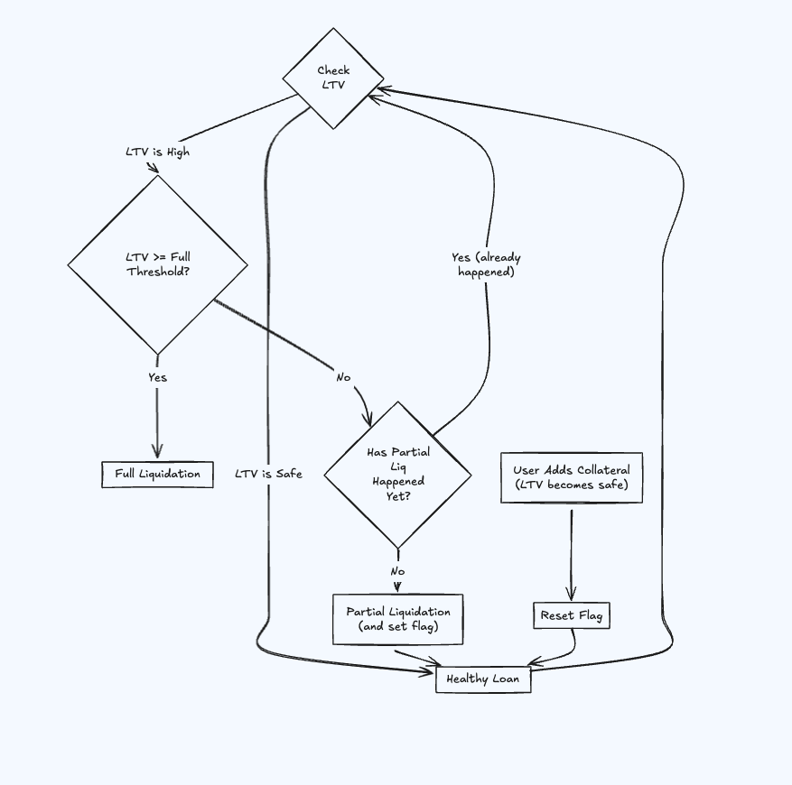
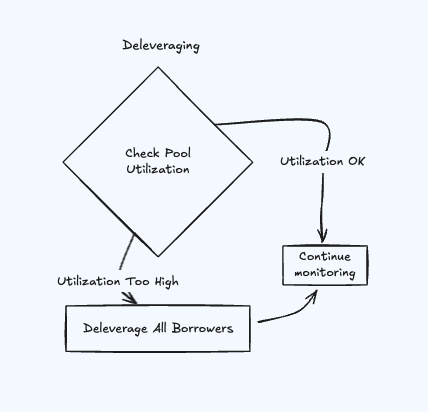

This mechanism safeguards both the **lenders’ funds** and the **integrity of the protocol**.

As a protocol, we are committed to returning the **exact amount of the principal token** that a lender has deposited. To ensure this, we must recover the **full value of the borrowed principal token** during liquidation.

Therefore, the **Loan-to-Value (LTV)** calculation is done entirely in terms of the **principal token** (or usd ) — for both the **borrowed amount** and the **current value of the position**.

Borrowers can avoid liquidation by **increasing their margin**, either:

- **Manually**, by adding more funds to the position, or
- **Automatically**, by enabling **auto-mode**, provided their wallet maintains sufficient balance. (in future)

### **LTV (Loan-to-Value) & Liquidation Logic**

**LTV (Loan-to-Value)** measures how much the borrower has borrowed compared to the current value of their position (LP + collateral).

- **Formula**:
    
    `LTV = Debt / Position Value`
    
    ```markdown
    Debt = principal × (BLI_now / BLI_entry)
    
    note - everywhere debt is constantly increasing using 
    this formula
    ```
    
- If the LTV gets too high (e.g., 85–90%), it means the borrower's position is no longer safely over-collateralized and is at risk.

---



### ⚙️ Trigger Rules

| Condition | Action |
| --- | --- |
| `LTV ≥ partial_threshold` **and** `has_been_partially_liquidated = false` | → Do **partial liquidation** (e.g. 50 %), then set `has_been_partially_liquidated = true` |
| `LTV ≥ full_threshold` **and** `has_been_partially_liquidated = true` | → **Fully liquidate** the remaining position |
| `LTV < safe_threshold` (e.g. user tops up collateral) | → Reset `has_been_partially_liquidated = false` |
|  |  |

### 🔥 **Partial Liquidation (Individual Risk Control)**

Partial liquidation is designed as a **borrower-friendly safeguard and a way to safeguard lenders fund from being completely lost** , offering a chance to stabilize their position **before full liquidation** is triggered — especially during volatile market conditions.

- **Trigger**: When an individual borrower's **LTV** crosses the **partial threshold** (e.g., 85%).
- **Action**: A calculated portion of their LP position is closed. The resulting assets are used to repay part of the debt.
- **Goal**: Bring the LTV back to a safer range (e.g., down to 75%) **without liquidating the entire position**.
- **Why**: This protects **lender funds** while giving borrowers a **fairer chance** to recover compared to immediate full liquidation.

---

### 🔁 One-Time Liquidation Logic

- **Partial liquidation** is triggered **once** per liquidation cycle.
- If the borrower **adds more funds** and LTV drops below the **safe threshold**, they become eligible for **partial liquidation again** in the future.
- For now, **partial liquidation is only applied to blue-chip and mid-cap assets**

---

### 💸 Precision-Based Recovery (Not Fixed Slice)

Unlike protocols that liquidate a **fixed slice** (e.g., 50%), our system calculates the exact value needed to **recover 80% of the lender’s principal**, based on:

- The **borrower’s leverage**
- Current **LTV**
- Position size and debt

Position to liquidate = 0.8 x borrowed amount 

📌 *Note: `borrowed amount = debt` in calculations.*

### State-Based Model (Simple Logic)

For each position, track a flag: `has_been_partially_liquidated`.

### ✅ Initial State:

- `has_been_partially_liquidated = false`

### Example Scenario

Let’s say:

- `partial_threshold = 80 %`
- `full_threshold = 90 %`
- `safe_threshold = 70 %`
1. Borrower LTV hits 80 %
    
    → Partial liquidation triggers, flag is set.
    
2. Borrower does **nothing**, LTV reaches 91 %
    
    → Full liquidation triggers.
    
3. If after partial liquidation borrower adds more collateral, LTV drops to 65 %
    
    → System resets the flag; they get another shot.
    

---

### 🌊 **Deleveraging (System-Wide Risk Control)**


we deleverage that is reduce the levergae (lenders fund that the borrower have borrowed)

- **Trigger**: Utilization of the lending pool exceeds a critical limit (e.g., 95%) and lenders may not be able to withdraw.
- **Action**: A portion of **all borrower positions** are liquidated proportionally, e.g., user1 has $200 borrowed, user2 $50 → both repay 10% of their debt.
- **Why**: Ensures the protocol maintains enough liquidity to satisfy lender withdrawals.

---

Calculate total debt to repay

**ΔB = totalBorrowed − (U_target × totalDeposits)**

ΔB = B − U_target · D

### How much each borrower must repay (pro-rata method)

For every borrower `i` with current debt `Debtᵢ`:

```
liquidateᵢ = Debtᵢ × (ΔB / B)
```

- Every borrower repays **the same percentage** of their outstanding debt:
    
    `percentage_to_repay = ΔB / B`
    
- After liquidation each borrower’s new debt is
    
    `Debtᵢ_new = Debtᵢ − liquidateᵢ` 