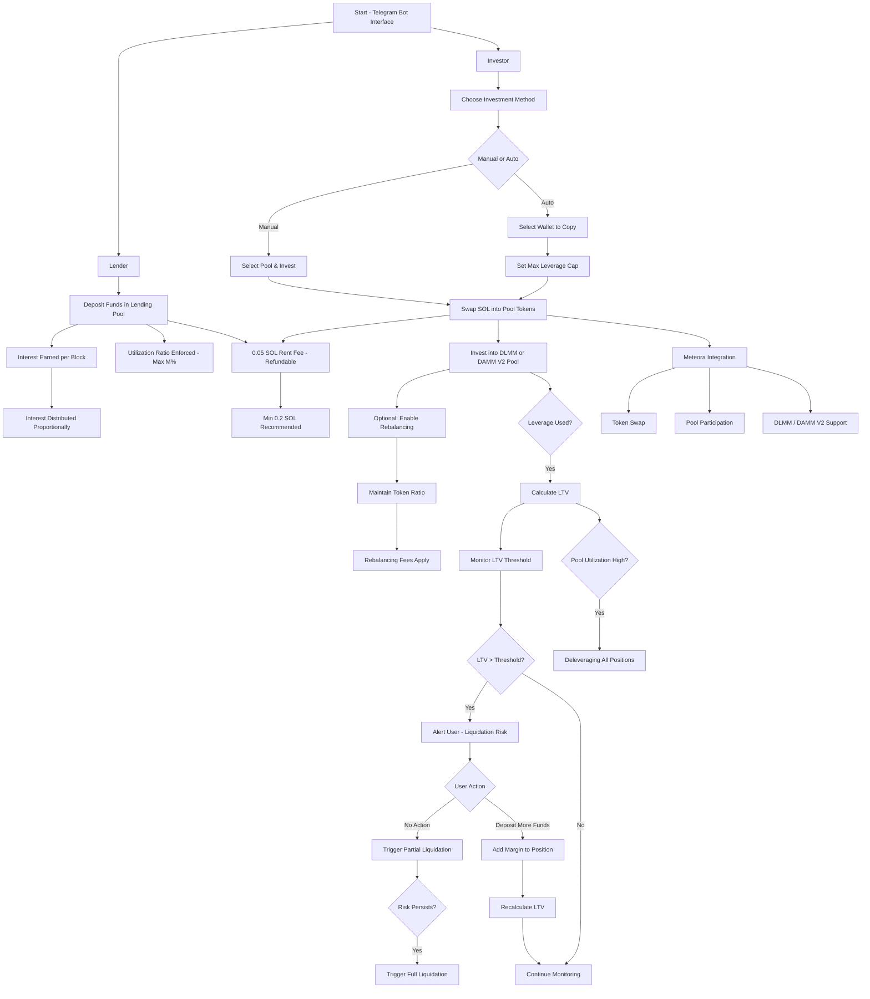

---

### Lenders

- Lenders deposit funds into the **lending pool**.
- The lending pool maintains a **maximum utilization ratio (M%)** to ensure health and availability of funds.
- **Interest** is earned by lenders based on the amount lent and utilization of the pool.
- Interest paid by borrowers is **distributed proportionally** among all lenders based on their share in the pool.
- Interest accrual occurs **per block**.

---

### LP users / Borrowers

- They can invest their own capital or **leverage** their position using funds from the lending pool.
- They bear the risk of **liquidation** based on their **Loan-to-Value (LTV)** ratio.
- Investment can be done in **DLMM** or **DAMM V2** pools.
- They can either:
    1. **Manually invest** in a chosen pool.
    2. Opt for **auto trading** by selecting a wallet to copy. All positions made by the selected wallet will be copied.
- Auto traders can set a **maximum leverage cap** for copied positions.
- Before investing, the user's deposited **SOL will be swapped** into relevant tokens based on the pool.

---

### **Rebalancing (Optional)**

- Users can opt in for **rebalancing**, which manages the token ratios during a position.
- It ensures positions stay within the optimal range, reducing the risk of impermanent loss or liquidation.
- Rebalancing fees apply.

---

### **Liquidation Mechanism**

Applies only when leverage is taken.

- The **liquidation system** is central to protocol risk management.
- It activates when an investor’s **LTV exceeds the threshold**, indicating a risky position.
- Supports:
    - **Partial liquidation** to recover lender funds.
    - **Full liquidation** if risks persist.
    - **Deleveraging** based on overall pool utilization.
    - User can deposit more funds to the position to increase their margin and save themselves from liquidation.

---

### **Fees**

- **Lenders**, **borrowers**, and **investors** are subject to specific fees based on their roles and actions (e.g., rebalancing).
- A **refundable Solana rent fee** is required to open a position on Meteora (~0.05 SOL) and keep the lending/borrowing account.
- A **minimum of 0.2 SOL** is recommended to ensure sufficient balance for operations.

---
