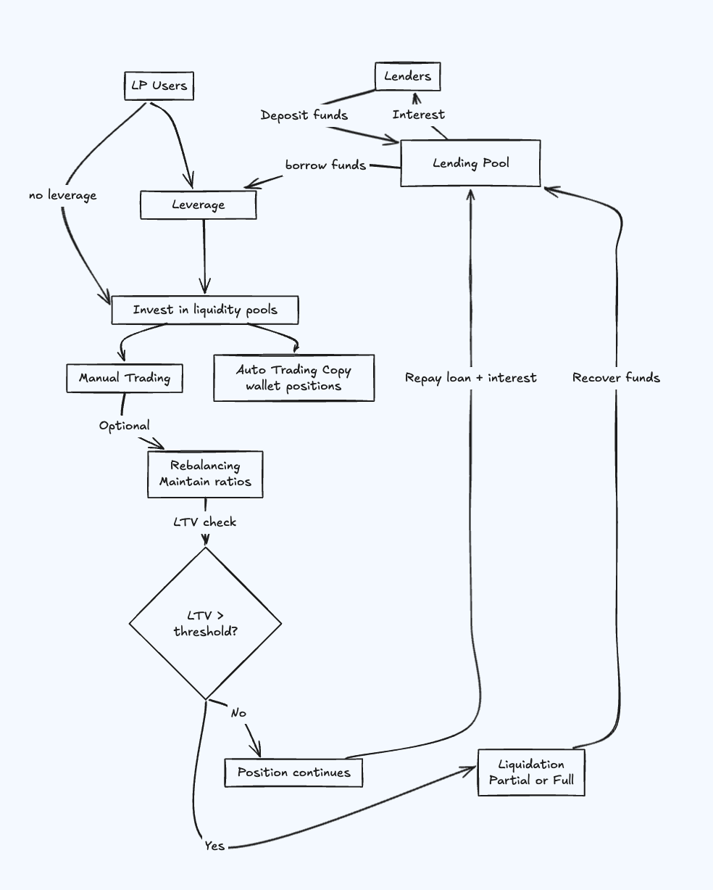

---
### Leveraged Liquidity Provisioning (LLP)

LLP enables users to leverage their liquidity positions in DeFi pools by borrowing capital from Paystream’s leveraged lending pool.This allows users to maximize yield by scaling their positions beyond their initial capital.Lenders also earn yield by supplying capital to fuel leveraged positions.

---

### Participants: Lenders and LP-Users 

Leveraged Liquidity Provisioning (LLP) revolves around two key participants - Lenders, who provide the capital that powers the leveraged liquidity , and LP-users , who utilize that capital to enter leveraged liquidity positions. This section outlines their roles, mechanics, and interactions within the protocol.

---

#### Lenders: Supplying Capital and Earning Yield

Lenders earn yield by depositing funds into Paystream’s leveraged lending pool. They are the liquidity backbone of the protocol, supplying base assets like SOL or USDC that enable borrowers to access leverage. In return, lenders earn passive income generated from interest paid by borrowers, all while maintaining the flexibility to withdraw their capital at any time.

- Lenders deposit funds into the lending pool, which operates with a maximum utilization ratio (M%) to maintain the overall health of the system and ensure sufficient fund availability. Interest is earned by lenders based on the amount they lend and the utilization level of the pool. The interest paid by borrowers is distributed proportionally among all lenders according to their share in the pool. Interest accrual occurs on a per-block basis, enabling real-time earning and transparency.

---

#### LP users / Borrowers: Amplifying Yield with Leverage

LP users on Paystream use the capital supplied by lenders to open leveraged positions in supported liquidity pools, aiming to enhance their yield through efficient capital deployment.

- they can choose to invest using their own capital or amplify their positions by leveraging funds from the lending pool. Each user assumes the risk of liquidation based on their Loan-to-Value (LTV) ratio. Investments can be made in DLMM or DAMM V2 pools, either manually by selecting a specific pool or automatically by copying trades from a chosen wallet. In auto-trading mode, all positions made by the selected wallet are mirrored, with the option to set a maximum leverage cap for added control. Before any investment, the user’s deposited SOL is automatically swapped into the relevant tokens required by the chosen pool.

---
### Risk Mitigation and Capital Optimization

Users can choose to trade manually by selecting pools themselves or opt for auto-trading by copying positions from another wallet. They can also enable optional rebalancing to maintain optimal token ratios and reduce the risk of impermanent loss. To protect the protocol and lenders, a liquidation mechanism is in place, which triggers if the user's Loan-to-Value (LTV) exceeds safe thresholds—helping mitigate risk in leveraged positions.

---

#### **Rebalancing (Optional)**

- Users can opt in for **rebalancing**, which manages the token ratios during a position.
- It ensures positions stay within the optimal range, reducing the risk of impermanent loss or liquidation.
- Rebalancing fees apply.

---

#### Liquidation Mechanism

- The liquidation mechanism applies only when leverage is taken and serves as a core component of the protocol's risk management system. It is triggered when an user's Loan-to-Value (LTV) ratio exceeds a predefined threshold, signaling increased risk. To protect lender capital and maintain system stability, the protocol supports partial liquidation to recover funds and full liquidation if the risk persists. Additionally, deleveraging actions may be taken based on overall pool utilization. User's have the option to deposit more funds into their position to boost their margin and avoid liquidation.
---

### **Fees**

- **LLP-Lenders** and **LP-users** are subject to specific fees based on their roles and actions (e.g., rebalancing).
- A **refundable Solana rent fee** is required to open a position on Meteora (~0.05 SOL) and keep the lending/borrowing account.
- A **minimum of 0.2 SOL** is recommended to ensure sufficient balance for operations.

---
