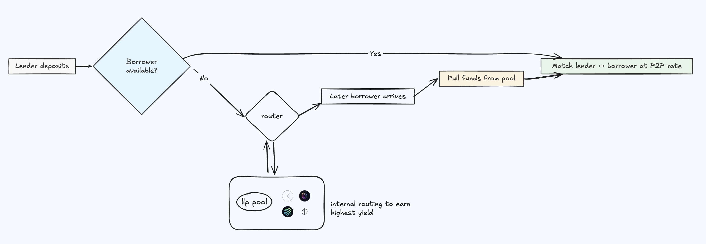
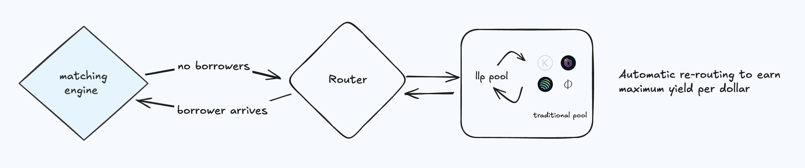

PayStream's **peer-to-peer (P2P) matching engine** is the core mechanism that directly matches lenders and borrowers on the platform for more optimised interest rates.

## How the Matching Engine Works

PayStream’s matching engine can be viewed as a **priority queue** or a **pseudo-order book** for matching loans. However, unlike a traditional order book, users do *not* place bids or asks with specific interest rates. Instead, the protocol automatically determines a fair P2P interest rate (one that lies between the pool’s supply APY and borrow APY) and matches lenders to borrowers at that rate.

This means lenders and borrowers don’t negotiate rates; any available lending liquidity will be paired with borrowing demand instantly at the optimised P2P rate.

### Matching Algorithm

At the core of Paystream's P2P engine is a **priority-based, real-time matching system** designed to pair lenders and borrowers efficiently while ensuring capital is never idle.

When a **new borrower** initiates a loan request, the matching engine attempts to fulfil it by pairing them with the **largest available lender** supplying the requested asset. This top-down approach continues, matching the borrower to the next largest lender, and so on, until the loan amount is fully satisfied or no further lender liquidity is available.

If the borrow request exceeds any single lender’s amount, the system can **split the borrow** across **multiple lenders**, in descending order of their supply size. This minimises fragmentation, maximises capital utilisation, and ensures efficient matching with minimal leftover idle funds.

This model achieves near-100% utilisation of matched funds: every P2P dollar lent is directly tied to a corresponding borrowed amount, eliminating capital inefficiencies typically seen in idle pool-based lending.

> Note: a borrower cannot put a borrow order greater than the available liquidity; it is blocked at the time.

---

## Routing idle liquidty 

The integration with underlying lending pools is a crucial aspect of PayStream’s design. Whenever a P2P match cannot be made or only partially fills, the unmatched portion of funds is automatically routed to the LLP lending pool and fallback pools.

This ensures that your capital never sits idle – it’s either matched P2P at an optimised rate or deployed to leveraged and fallback strategies that continue generating returns.

Whenever the P2P queue can’t immediately pair lenders with borrowers, PayStream seamlessly redirects idle liquidity into the LLP lending pool, which channels it into leveraged strategies, and to integrated fallback pools on leading Solana protocols such as Drift, Kamino, MarginFi, and Save Finance. This guarantees that capital keeps earning yield until a matching borrower arrives, maintaining full capital utilisation and eliminating idle liquidity.

**Example:**

1. **Alice (Lender) joins first**
    - Alice deposits USDC into Paystream. Since no borrower is waiting, her funds are **automatically deposited into a fallback liquidity pool** (like Kamino or MarginFi) to ensure yield is earned.
2. **Bob (Borrower) joins later**
    - When Bob borrows USDC, Paystream checks for matched P2P liquidity. It sees Alice’s funds in the fallback pool, **withdraws them instantly**, and **matches her to Bob** at an optimised P2P interest rate.

---

## Overcollateralization and LTV

PayStream is an overcollateralized lending system, meaning borrowers must supply collateral to secure their loans. Every borrower first **deposits assets as collateral**, which makes them a lender on that side of the market before they borrow another asset. Collateral deposits are deposited in the underlying pool – thus **even collateral can earn interest** while posted.

PayStream enforces the same **Loan-to-Value (LTV)** ratios and **liquidation thresholds** as the underlying protocols it integrates with, to maintain consistency and security. In practice, this means for each supported asset, there is a maximum borrowable percentage of its value (LTV), and if a borrower’s debt exceeds a certain percentage (the liquidation threshold, slightly higher than LTV), their position can be liquidated