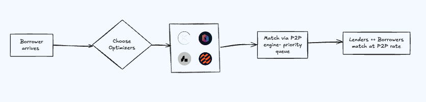

In Paystream, idle capital is never left idle. When a lender’s funds are not immediately matched with a borrower in the P2P market, they are automatically deployed to the LLP lending pool and diversified fallback pools. This ensures the capital continues to generate yield at all times.

The LLP lending pool acts as the primary yield engine, deploying liquidity into leveraged positions in liquidity pools, while fallback pools serve as secondary destinations that provide yields on idle liquidty. Together, this structure eliminates idle liquidity, maintains continuous capital utilisation, and maximises APY for lenders.

This dynamic routing means lenders enjoy consistent returns, LP users access leveraged capital efficiently, and the overall system maintains a self‑sustaining capital flywheel with zero idle capital.
---

Alongside optimisers, Paystream organises liquidity using **markets**, each associated with a specific token (e.g., USDC, SOL, JITO) and a specific optimiser. That means we don’t just have “a USDC market”, we may have multiple USDC markets, each tied to a different optimiser like Kamino or Drift.

Once a market becomes full, meaning it reaches a preset cap on the number of lenders and borrowers, Paystream will automatically **spin up a new market** for the same token and optimiser.  