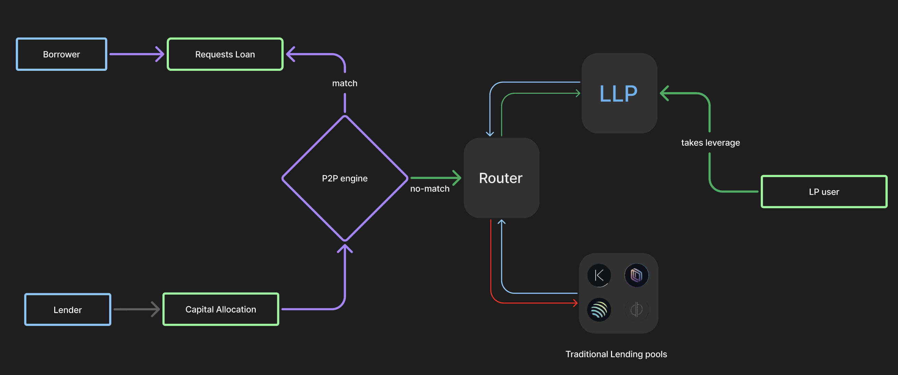

- **P2P Matching Engine**: Borrowers are directly matched with lenders in real-time, ensuring optimal interest rates for both parties without relying solely on pooled liquidity.

- **Fallback to Liquidity Pools**: When a direct match isn't available, the system utilizes external liquidity platforms like Kamino to fulfill requests instantly. This ensures continuous lending opportunities and yield for idle lender capital.

- **Collateralized Borrowing**: Borrowers deposit collateral to borrow funds. This collateral is deployed into underlying protocol so that it earns while backing the loan, maximizing capital efficiency.

- **Protocol-Level Risk Controls**: If a borrower fails to make repayments, a proportional portion of their collateral is automatically liquidated. This ensures the protocol stays solvent and protects lenders from bad debt.

- **Instant Liquidity for Lenders**: Unmatched lender capital remains liquid and accessible. Lenders can withdraw or modify their offers at any time without being locked in.

- **Leveraged Liquidity Provisioning**: Users can invest in liquidity pools with leverage ranging from 1x to 4x by borrowing additional capital through PayStream and paying interest on the borrowed funds. This LLP layer will serves as both an incentive for borrowers and a fallback mechanism for unmatched P2P funds.